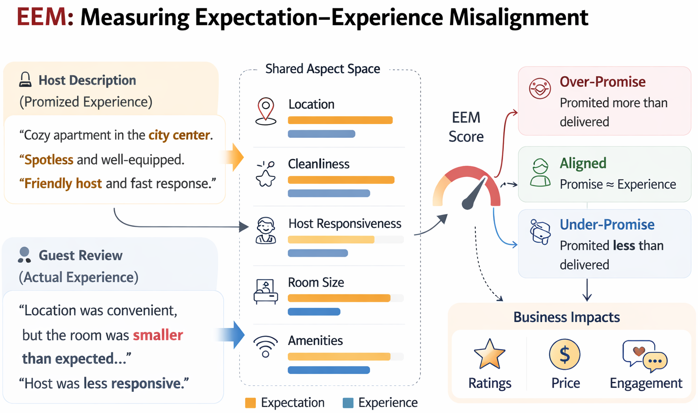

# UCSD CSE261-WI26: EEM: Measuring Expectation-Experience Misalignment in Marketplace Text



End-to-end pipeline for measuring description-review mismatch and testing its predictive value.

## Download Required Data and Checkpoints

Google Drive folder (processed datasets, LLM-scored datasets, fine-tuned checkpoints):

- https://drive.google.com/drive/folders/1GQpmQEm8Nbj3oiZuPV5DCeUVoWUtClGG?usp=sharing

Please download the necessary dataset or checkpoint, and place them in the following structure:

```
Project/
├── Space_Formation_Embedding_Extraction/
│   ├── airbnb-al.csv
│   ├── airbnb-am.csv
│   ├── airbnb-mo.csv
│   ├── out_airbnb_k10/
│   │   ├── taxonomy.json
│   │   └── teacher_scores_2000.csv
│   └── student_deberta_al/
│       ├── model.safetensors
│       ├── student_meta.json
│       ├── tokenizer.json
│       ├── tokenizer_config.json
│       ├── special_tokens_map.json
│       └── spm.model
├── Baseline/
│   ├── airbnb_glove_embeddings-al.csv
│   ├── airbnb_glove_embeddings-am.csv
│   └── airbnb_glove_embeddings-mo.csv
├── Mismatch_Score/
│   ├── al/   (generated after running Step 3)
│   ├── am/
│   └── mo/
└── Edge_Case_Analysis/
```

## Project structure

- `Preprocessing/` (Step 1): data collection and cleaning notebooks
- `Space_Formation_Embedding_Extraction/` (Step 2): aspect-space construction, teacher scoring, student training/inference
- `Mismatch_Score/` (Step 3): mismatch proxy and delta metrics
- `Edge_Case_Analysis/` (Step 4): downstream classification/regression analysis
- `Baseline/`: GloVe baseline embeddings used by Step 3

## How to run the whole project

## 1) Preprocess data

```bash
cd Preprocessing
jupyter lab
```

Run relevant notebooks (for example `get_airbnb_data_al.ipynb`) to prepare CSVs.

## 2) Build aspect space and teacher labels

```bash
cd ../Space_Formation_Embedding_Extraction
CUDA_VISIBLE_DEVICES=4 python airbnb_aspect_space_llm.py \
  --csv_path airbnb-al.csv \
  --listing_col listing_id \
  --desc_col description \
  --review_col review \
  --K 10 \
  --score_n 4000 \
  --score_unique_listing \
  --score_k_per_listing 4 \
  --score_seed 0 \
  --out_dir out_airbnb_k10
```

## 3) Train student model

```bash
CUDA_VISIBLE_DEVICES=4 python train_student.py \
  --train_csv out_airbnb_k10/teacher_scores_2000.csv \
  --save_dir student_deberta_al \
  --model_name microsoft/deberta-v3-large \
  --K 10 --max_length 512 \
  --train_bs 8 --eval_bs 16 --epochs 20 \
  --lr 2e-5 --weight_decay 0.01 --warmup_ratio 0.03 \
  --fp16
```

## 4) Infer full student scores

```bash
CUDA_VISIBLE_DEVICES=4 python infer_student.py \
  --student_dir student_deberta_al \
  --csv_path airbnb-al.csv \
  --out_csv student_scores_al.csv \
  --desc_col description --review_col review \
  --batch_size 32 --clamp
```

## 5) Evaluate student vs baseline

```bash
CUDA_VISIBLE_DEVICES=5 python eval_student_vs_baseline.py \
  --student_dir student_deberta_al \
  --teacher_csv out_airbnb_k10/teacher_scores_2000.csv \
  --batch_size 64 \
  --bootstrap 2000 \
  --device cuda
```

## 6) Compute mismatch scores

```bash
cd ../Mismatch_Score
python mismatch_proxy_score.py
```

Before running, set the dataset selector in `mismatch_proxy_score.py`:

```python
dataset = "al"  # al / am / mo
```

## 7) Run edge-case analysis

```bash
cd ../Edge_Case_Analysis
python joint_classification_regression.py \
  --listings-path listings.csv \
  --mismatch-path ../Mismatch_Score/al/llm_mismatch_score.csv \
  --baseline-path ../Mismatch_Score/al/baseline_mismatch_score.csv \
  --mode both
```


## Notes

- `airbnb_aspect_space_llm.py` can be GPU-intensive. In practice, you may need one 80GB GPU or two 40GB GPUs.
- If this is too expensive, try a smaller open-source model (for example Qwen 8B), or use an API-based model instead of local deployment.
